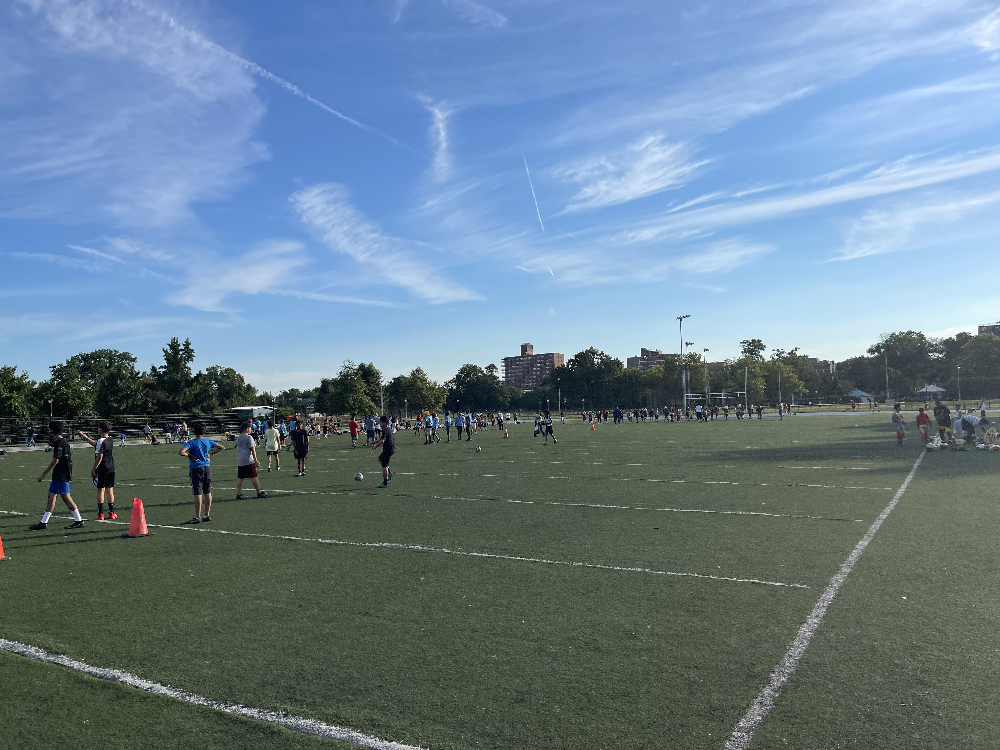
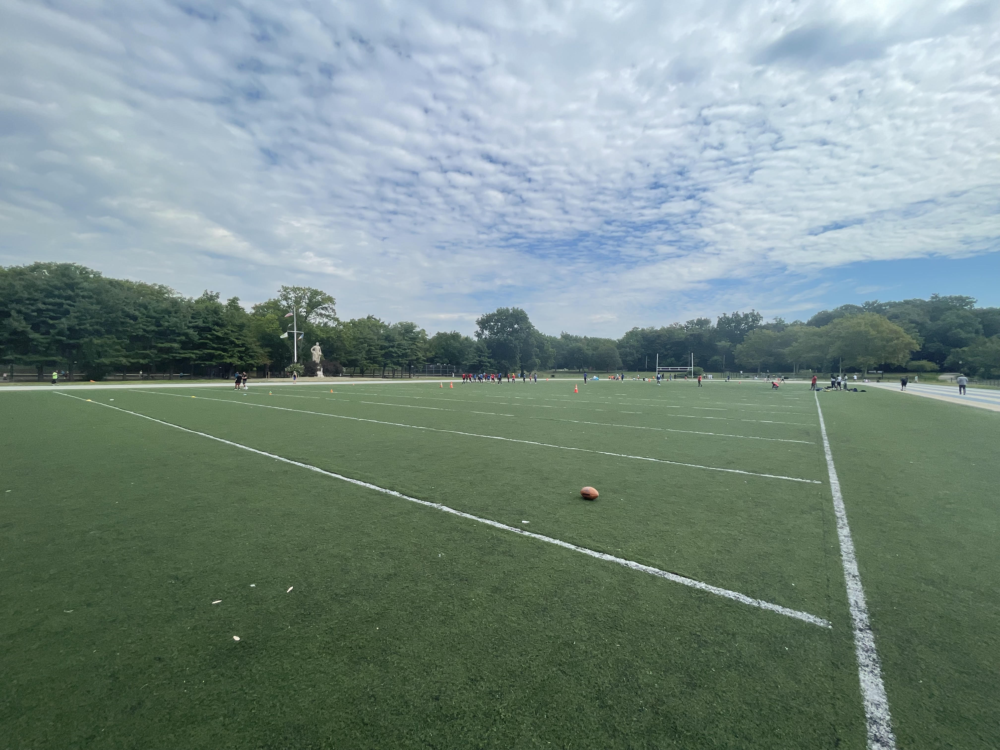

## Welcome to QB Camp

From the BX to World Wide.

 

### Upcoming Schedule

August 28, 2022 @ 1 P.M. (Rockland County)

### Past Schedule

~~August 23, 2022 @ 6 P.M. (Pelham Bay Park)~~
~~August 20, 2022 @ 10 A.M. (Pelham Bay Park)~~ \
~~August 18, 2022 @ 6 P.M. (Pelham Bay Park) (cancelled)~~ \
~~August 16, 2022 @ 6 P.M. (Pelham Bay Park)~~

### Contact

Hit up Coach Vat.

### Playbook and warmup routine

[Current 7-on-7 Playbook](https://github.com/aglucaci/qb-camp/raw/gh-pages/PDFs/ADM-7-on-7-Flag-Playbook.pdf)

### Training photos

### Conditioning resources

[Couch to 5k](http://www.c25k.com/c25k_metric.html)

### Coaching resources

[PDFs](https://github.com/aglucaci/qb-camp/tree/gh-pages/PDFs)

### Interesting Film

[Men's Flag Football Championship Italy vs USA 2022 World Games](https://www.youtube.com/watch?v=nYb3I9DLawk)
